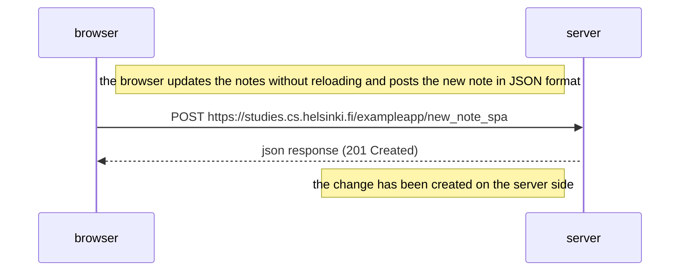

```mermaid
sequenceDiagram
    participant browser
    participant server
    Note right of browser: the browser updates the notes without reloading and posts the new note in JSON format
    browser->>server: POST https://studies.cs.helsinki.fi/exampleapp/new_note_spa
    activate server
    server-->>browser: json response (201 Created)
    Note left of server: the change has been created on the server side
```